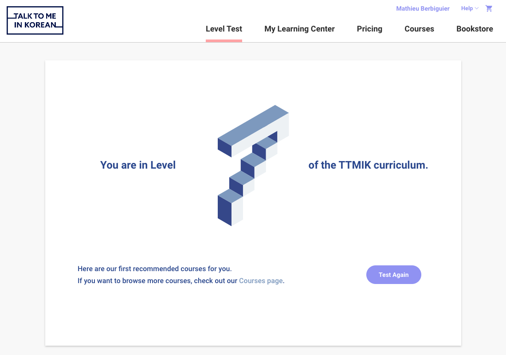
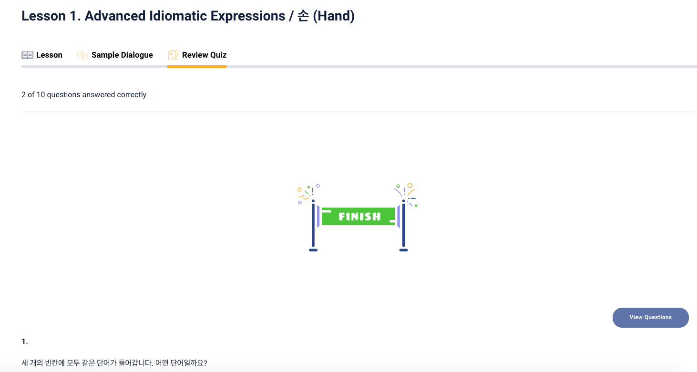

# DH250: User Experience and Design - Assignment 01
## Tentative Project Name: Deok_UP // Learn Korean through Korean Pop Culture! 
*Mathieu Berbiguier, Ph. D. Student (ALC)*

> My research revolves around Korean popular culture (especially K-pop), its international reception and the consequences of it. In Korean studies, the relevance of K-pop and other Korean pop culture elements are always undermined - and yet, one of the biggest reason why students get into studying Korean is K-pop or K-dramas! Because of this, students only take language classes and few of them get into more content-oriented classes - and do not get further. I'd like to shape a project that take into consideration my teaching philosophy that is: content and language should equally be incorporated in the curriculum, and to do so, we should incorporate more Korean pop culture into Korean learning tools. The UX design that I am aiming for needs to be intuitive, and the user should only focus on learning Korean and not bother of learning how the app works for a while before getting started.

Type of Info | Application 1 | Application 2 
------------ | -------------| -------------
Name | Talk to me in Korean | Koreanclass101
URL | https://talktomeinkorean.com/ | https://www.koreanclass101.com/
Screenshot |  | 
Information | One of the most famous website to learn Korean. They started as podcasts and developped into an interactive textbook that is subscription based. There is also a free version, which is the one I will test in this assignment. | Similarly with Talk to me in Korean, KoreanClass101 also offers Korean classes - they are also subscription based but seem to offer more features in their free trial than TTMIK.
Overall evaluation | Overall, TTMIK adopts a very minimalist aesthetic, with pastel colors and not a lot of informations shown on the screen. The choice of having a long-scrolling website, is, in my opinion, what makes some of the heuristic principles hardly applicable on it. | On the other hand, KoreanClass101 adopts a less pleasing aesthetic, yet more functional - but maybe a little bit too much. There is too many informations on the screen and the user can easily feel lost, and does not really not what to do.
> In conclusion, the analysis of both websites helped me to understand that I would like something as functional as KoreanClass101, but as esthetically pleasing as TTMIL.

### Heuristics Evaluation of TTMIK
#### (1) Visibility of System Status 
**RESPECTED** - 1) There is a progression bar that appears often, during the level test (made to guide you through the different levels/lessons), but also while going over the content of the lesson themselves. 

2) The menu reminds you in which page you are located by underlining the position of the user in the website map.

**Severity Rating:** 1 

#### (2) Connection between System/Real World
**INCOMPLETE** - Since the website appears to be an online textbook, it would have been good to recreate the experience of "reading" or "going over" the textbook: with arrows, pages, some animations. Here the only arrow is at the bottom of the scrolling page, and just makes you go to the next lesson.

**Severity Rating:** 2

#### (3) User Control and Freedom
**NOT RESPECTED** - 1) The layout of the page when it comes to lessons is too linear, and we can't navigate between the tabs once we are scrolling further down. The tabs that were showing the script of the lesson, but also the quiz, disapear.

(Example of the layout of a lesson)
2) Every lesson starts with an embedded file from soundcloud that the learner is supposed to listen while following along to the text of the lesson. It would have been great to incorporate a audio player that makes it possible to pause while reading.

**Severity Rating:** 3

#### (4) Consistency and Standards
**INCOMPLETE** - There is a lack of consistency when it comes to the availability of the "help" page. It appears on the main menu, the dashboard that shows the progress in the learning.

but it doesn't appear inside a lesson.

**Severity Rating:** 2

#### (5) Error Prevention
**NOT RESPECTED** - When you leave the level test by mistake, it just gives you the result considering how far in the questions you went - it does not ask you a question like "Do you really want to end the level test?" which could be very frustrating. Same when taking a quiz.

This is a screenshot that shows that they told me to go to level 1 because I clicked on another link by mistake while taking the test.
**Severity Rating:** 3

#### (6) Recognition rather than Recall
**RESPECTED** - Recalls what was the last lesson you worked on so you can start again where you left it.

**Severity Rating:** 1

#### (7) Flexibility and Efficiency of Use
**NOT RESPECTED** - No shortcuts of any sort, even to use during the quizzes

**Severity Rating:** 2

#### (8) Aesthetic and Minimalist Design
**INCOMPLETE** - The layout of the website makes that it focuses always on the essential information but because of the constant use of scrolling design for every part, it makes the user sometimes miss important indications. For example, after the level test, the website suggests you lessons and books to purchase, but we can't see them unless we scroll.

**Severity Rating:** 2

#### (9) Help users recognize, diagnose and recover from errors
**INCOMPLETE** - 1) Explains clearly and highlights where the problem is (log in screen) 

2) After a quiz, the only way to re-take it is to "undo" the lesson, but the button is not easy to find.
 
(screen after taking a quiz)

(screen that shows where to "undo" the lesson - on a different page than where the quiz was taken.)
3) When an error occurs during a search, there is no suggestion to recover.

**Severity Rating:** 3

#### (10) Help and Documentation
**INCOMPLETE** - Help page is very well designed but hosted on a different platform and doesn't appear on the screen of the lessons. 

**Severity Rating:** 2

### Heuristics Evaluation of KoreanClass101
#### (1) Visibility of System Status 
**RESPECTED** - 1) There is a progression bar that appears often, during the level test (made to guide you through the different levels/lessons), but also while going over the content of the lesson themselves. 

2) The menu reminds you in which page you are located by underlining the position of the user in the website map.

**Severity Rating:** 1 

#### (2) Connection between System/Real World
**INCOMPLETE** - Since the website appears to be an online textbook, it would have been good to recreate the experience of "reading" or "going over" the textbook: with arrows, pages, some animations. Here the only arrow is at the bottom of the scrolling page, and just makes you go to the next lesson.

**Severity Rating:** 2

#### (3) User Control and Freedom
**NOT RESPECTED** - 1) The layout of the page when it comes to lessons is too linear, and we can't navigate between the tabs once we are scrolling further down. The tabs that were showing the script of the lesson, but also the quiz, disapear.

(Example of the layout of a lesson)
2) Every lesson starts with an embedded file from soundcloud that the learner is supposed to listen while following along to the text of the lesson. It would have been great to incorporate a audio player that makes it possible to pause while reading.

**Severity Rating:** 3

#### (4) Consistency and Standards
**INCOMPLETE** - There is a lack of consistency when it comes to the availability of the "help" page. It appears on the main menu, the dashboard that shows the progress in the learning.

but it doesn't appear inside a lesson.

**Severity Rating:** 2

#### (5) Error Prevention
**NOT RESPECTED** - When you leave the level test by mistake, it just gives you the result considering how far in the questions you went - it does not ask you a question like "Do you really want to end the level test?" which could be very frustrating. Same when taking a quiz.

This is a screenshot that shows that they told me to go to level 1 because I clicked on another link by mistake while taking the test.
**Severity Rating:** 3

#### (6) Recognition rather than Recall
**RESPECTED** - Recalls what was the last lesson you worked on so you can start again where you left it.

**Severity Rating:** 1

#### (7) Flexibility and Efficiency of Use
**NOT RESPECTED** - No shortcuts of any sort, even to use during the quizzes

**Severity Rating:** 2

#### (8) Aesthetic and Minimalist Design
**INCOMPLETE** - The layout of the website makes that it focuses always on the essential information but because of the constant use of scrolling design for every part, it makes the user sometimes miss important indications. For example, after the level test, the website suggests you lessons and books to purchase, but we can't see them unless we scroll.

**Severity Rating:** 2

#### (9) Help users recognize, diagnose and recover from errors
**INCOMPLETE** - 1) Explains clearly and highlights where the problem is (log in screen) 

2) After a quiz, the only way to re-take it is to "undo" the lesson, but the button is not easy to find.
 
(screen after taking a quiz)

(screen that shows where to "undo" the lesson - on a different page than where the quiz was taken.)
3) When an error occurs during a search, there is no suggestion to recover.

**Severity Rating:** 3

#### (10) Help and Documentation
**INCOMPLETE** - Help page is very well designed but hosted on a different platform and doesn't appear on the screen of the lessons. 

**Severity Rating:** 2
